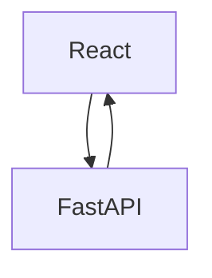

# Cross Species Mappper

This is the README file for the Cross Species Mappper project. It provides a webapp for an interactive mapper which transforms the cognitive ontology between humans and macaques to provide translational exploration.

## Installation

To install the project for local development, follow these steps:

1. Clone the repository to your local machine.
2. From the `frontend` directory, install the required dependencies using `npm install`.
3. Install `poetry` with `pip install poetry`.
4. From the api directory, install the required dependencies with
   `poetry install`.
5. Start the frontend server by going into the `frontend` directory and typing `npm run dev`.
6. Start the api server by going into the `api` directory and
   typing `poetry run uvicorn src.main:app --reload`.

## Usage

The intended usage of this repository is through its Docker Compose.

1. Install Docker Compose if you haven't already. You can download it from the Docker website.
2. From the root directory of the project, run docker-compose up to start the application. This will build and start all of the services defined in the docker-compose.yml file.
3. Access the frontend by navigating to http://localhost:3000 in your web browser.
4. Access the API OpenAPI specification by navigating to http://localhost:8000/docs in your web browser.

## Code Architecture

The architecture of this project is fairly small. It uses a React frontend for displaying the webpage. This frontend communicates with an API based on Python's FastAPI.

## Contributing

Before contributing, please see our contribution guidelines in CONTRIBUTING.md in the root of this repository. To contribute to the project, follow these steps.

1. Fork the repository.
2. Create a new branch for your changes.
3. Make your changes and commit them.
4. Push your changes to your fork.
5. Submit a pull request to the main repository.

## License

This project is licensed under the MIT License. See the LICENSE file for details.
